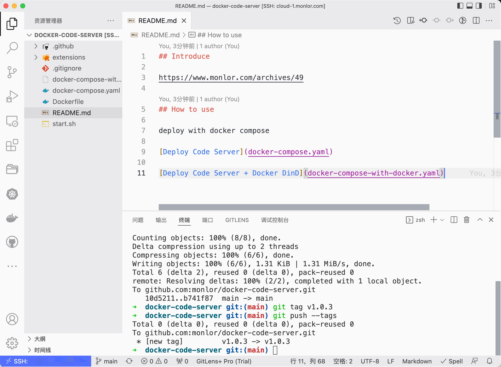

## Introduce

https://www.monlor.com/archives/49



## How to use

deploy with docker compose

[Deploy Code Server](docker-compose.yaml)

[Deploy Code Server + Docker DinD](docker-compose-with-docker.yaml)

## 工作目录

默认目录为`/home/coder`，建议持久化这个目录
支持juiceFS分布式文件系统，配置以下变量启用，将会自动挂载到`/home/coder`目录
* META_URL 元数据引擎 redis/mysql 连接地址
* META_PASSWORD 元数据引擎连接密码

## Tools

### git cz

run in your git project

```bash
commitizen init git-cz --save-dev --save-exact
git cz
```

### YouDao Translate

add env: YDCV_YOUDAO_APPID YDCV_YOUDAO_APPSEC

```bash
ydcv hello
```

### Trash

https://github.com/andreafrancia/trash-cli

```bash
trash-list
```

## Custom

### Custom zshrc

add to `/home/coder/.zshrc.user`

### Custom binary

add to `/home/coder/.local/bin`